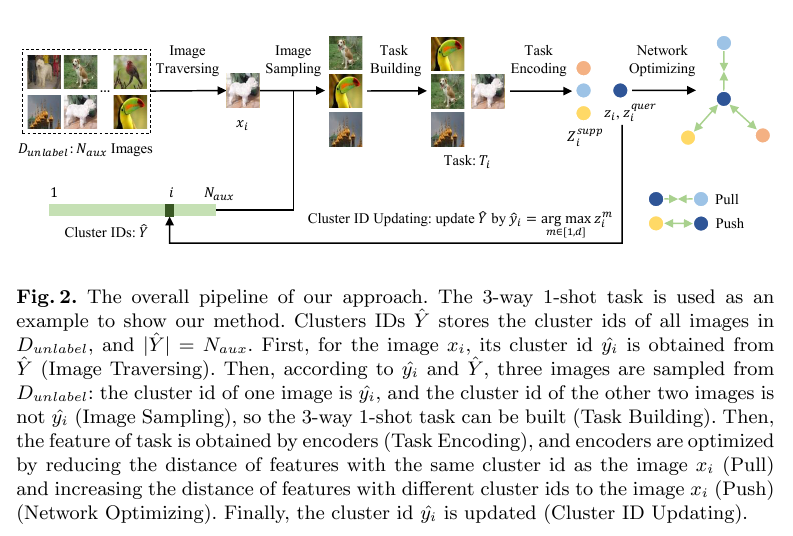
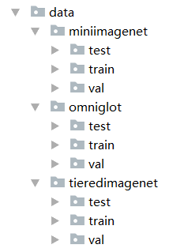
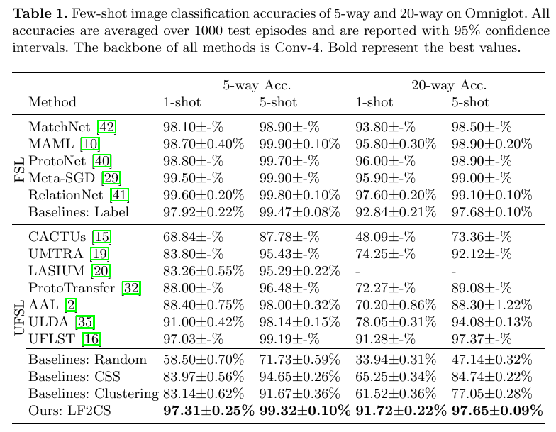
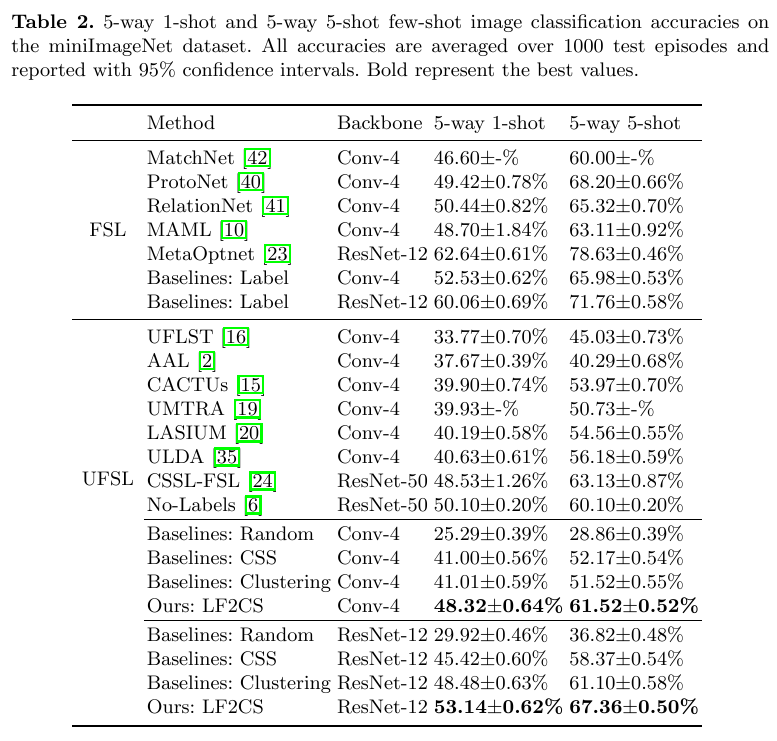
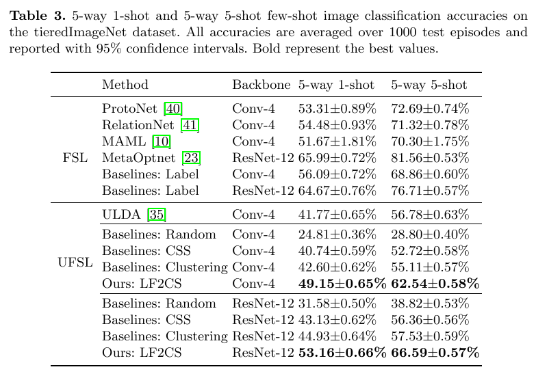
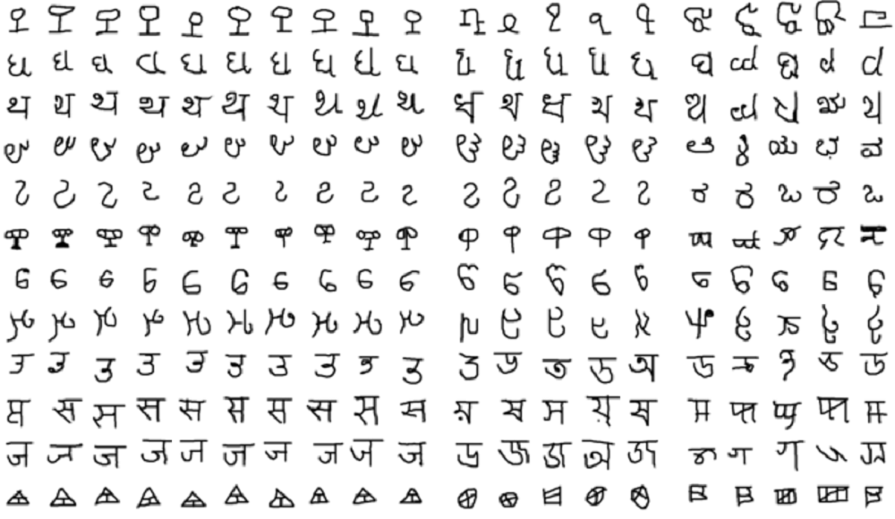
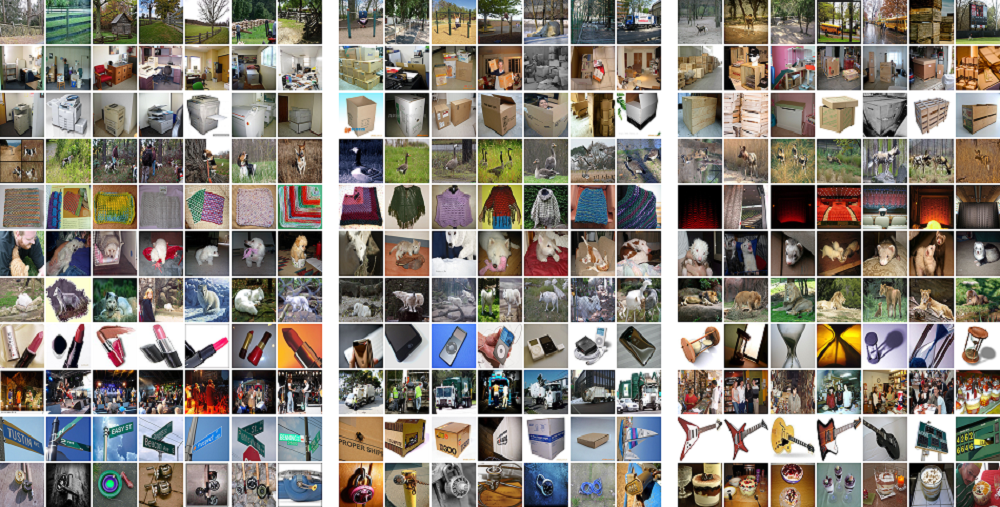

# Code Readme

The code of *Unsupervised Few-Shot Image Classification by Learning Features into Clustering Space* (ECCV 2022)


## Abstract

Most few-shot image classification methods are trained based on tasks. Usually, tasks are built on base classes with a large number of labeled images, which consumes large effort. Unsupervised few-shot image classification methods do not need labeled images, because they require tasks to be built on unlabeled images. In order to efficiently build tasks with unlabeled images, we propose a novel single-stage clustering method: Learning Features into Clustering Space (LF2CS), which first set a separable clustering space by fixing the clustering centers and then use a learnable model to learn features into the clustering space. Based on our LF2CS, we put forward an image sampling and c-way k-shot task building method. With this, we propose a novel unsupervised few-shot image classification method, which jointly learns the learnable model, clustering and few-shot image classification. Experiments and visualization show that our LF2CS has a strong ability to generalize to the novel categories. From the perspective of image sampling, we implement four baselines according to how to build tasks. We conduct experiments on the Omniglot, miniImageNet, tieredImageNet and CIFARFS datasets based on the Conv-4 and ResNet-12 backbones. Experimental results show that ours outperform the state-of-the-art methods.

## The Overall Pipeline

The overall pipeline of our approach, taking 3-way 1-shot as an example.




## Installing

Install the required packages through the following command:
```
pip install -r requirements.txt
```


## Data

Limited by file size, we only provide Omniglot for demonstration. You can download the data to the corresponding folder. 

The organization of the data is shown below.




## Training

**Please unzip the Omniglot dataset before training.**

You can directly train on Omniglot through the following command:

```
python main.py -gpuid 0 -type train -dataset omniglot
```


## Test

**Please unzip the Omniglot dataset before test.**

You can directly test on Omniglot through the following command:

```
python main.py -gpuid 0 -type test -dataset omniglot -checkpoint ./models/omniglot/our/our.pkl
```


## Experimental results

Table 1 shows the few-shot image classification accuracies on Omniglot.



Table 2 shows the few-shot image classification accuracies on miniImagenet.



Table 3 shows the few-shot image classification accuracies on tieredImagenet.




## Visualizations

The figure below shows some images in some clusters, which are divided into three parts. Among them, the left, middle, and right show the images in the training, validation, and test sets of Omniglot, respectively. The images of each row come from the same cluster.




The figure below shows some images in some clusters, which are divided into three parts. Among them, the left, middle, and right show the images in the training, validation, and test sets of miniImageNet, respectively. The images of each row come from the same cluster.




## Conclusion


In our work, we propose a novel single-stage clustering method: Learning Features into Clustering Space (LF2CS), which fixes the cluster center matrix to the identity matrix, thereby setting a strongly separable clustering space, and then learns features into the clustering space. Based on this, we put forward an image sampling and task building method, and with this, we propose an unsupervised few-shot image classification method. Experimental results and visualization show that our LF2CS has a strong ability to generalize to the novel categories. Based on Conv-4 and ResNet-12, we conduct experiments on four FSL datasets, and our method achieves the state-of-the-art results.


